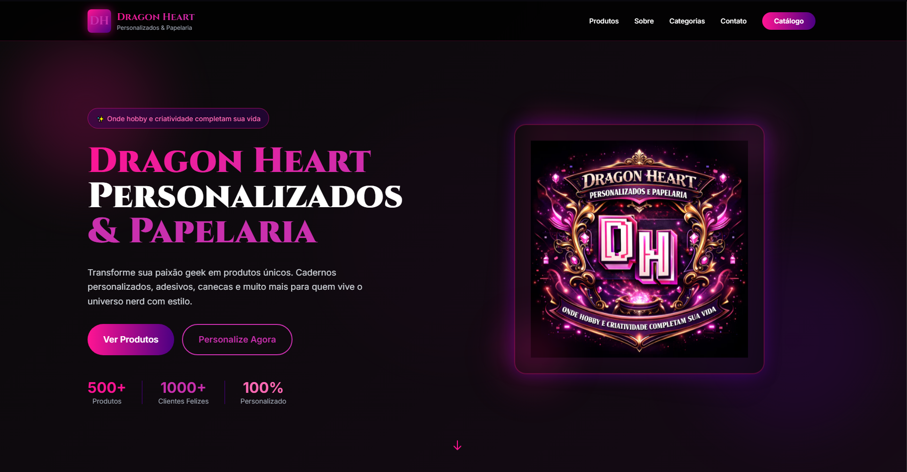
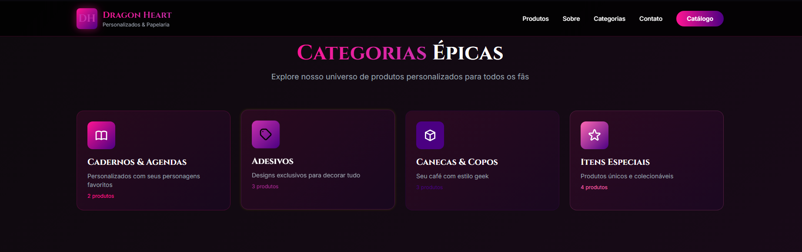
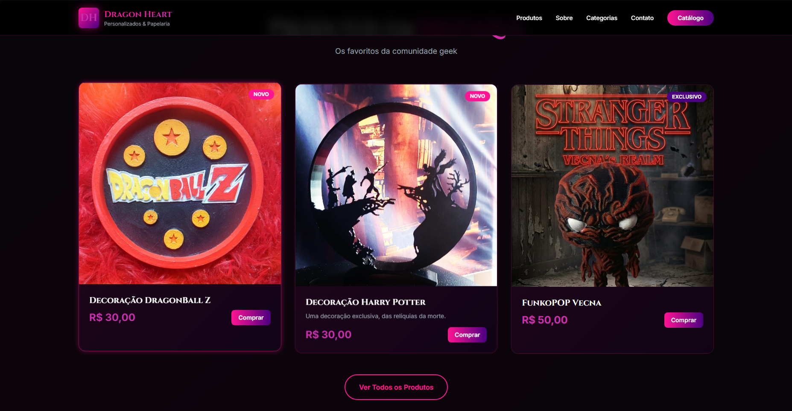
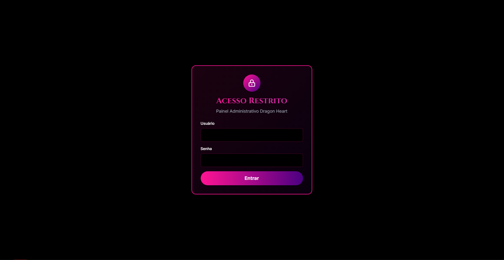
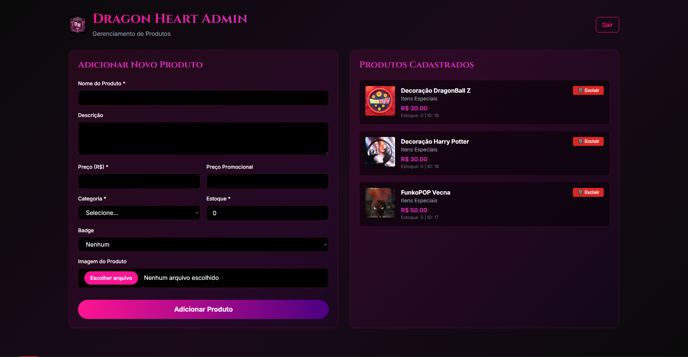

# 🐉 Dragon Heart - E-Commerce Completo

E-commerce completo com frontend moderno, backend Node.js, PostgreSQL e painel administrativo.

Acesso ao site em : https://startling-cendol-e77d87.netlify.app

---

## 📋 Índice

1. [Visão Geral](#-visão-geral)
2. [Instalação e Configuração](#-instalação-e-configuração)
3. [Como Usar](#-como-usar)
4. [Gerenciar Produtos](#-gerenciar-produtos)
5. [Deploy em Produção](#-deploy-em-produção)
6. [Estrutura do Projeto](#-estrutura-do-projeto)
7. [Tecnologias](#-tecnologias)
8. [Troubleshooting](#-troubleshooting)
9. [Screenshots](#-screenshots)

---

## 🎯 Visão Geral

Sistema completo de e-commerce com:
- ✅ **Site público** com catálogo de produtos
- ✅ **Painel administrativo** com autenticação
- ✅ **Backend API** REST com Node.js + Express
- ✅ **Banco de dados** PostgreSQL
- ✅ **Upload de imagens** para produtos
- ✅ **Sistema de carrinho** e pedidos
- ✅ **Categorias dinâmicas**

---

## 📸 Screenshots

### Site Principal

*Landing page com design moderno e responsivo*

### Categorias de Produtos

*Categorias dinâmicas carregadas do banco de dados*

### Produtos em Destaque

*Grid de produtos com imagens, preços e badges*

### Painel Administrativo

*Tela de login do painel admin*


*Interface para adicionar e gerenciar produtos*

---

## 🚀 Instalação e Configuração

### Pré-requisitos

- **Node.js** 16+ ([Download](https://nodejs.org/))
- **PostgreSQL** 14+ ([Download](https://www.postgresql.org/download/))
- **Git** (opcional, para deploy)

### Passo 1: Instalar PostgreSQL

#### Windows:
1. Baixe o instalador: https://www.postgresql.org/download/windows/
2. Execute e siga o assistente
3. **Anote a senha** que você definir para o usuário `postgres`
4. Porta padrão: `5432`

#### Verificar instalação:
```bash
psql --version
```

### Passo 2: Criar o Banco de Dados

1. Abra o **pgAdmin** ou **DBeaver**
2. Conecte ao servidor PostgreSQL (localhost:5432)
3. Crie um novo banco chamado: **`dragon_heart`**

**Ou via terminal:**
```bash
psql -U postgres
CREATE DATABASE dragon_heart;
\q
```

### Passo 3: Executar Scripts SQL

No DBeaver ou pgAdmin, execute na ordem:

1. **`backend/database/schema.sql`** - Cria as tabelas
2. **`backend/database/seed.sql`** - Insere dados iniciais

### Passo 4: Configurar Backend

1. Entre na pasta backend:
```bash
cd backend
```

2. Instale as dependências:
```bash
npm install
```

3. Crie o arquivo **`.env`** (copie de `.env.example`):
```env
# Banco de Dados
DB_HOST=localhost
DB_PORT=5432
DB_NAME=dragon_heart
DB_USER=postgres
DB_PASSWORD=SUA_SENHA_AQUI

# Servidor
PORT=3000

# WhatsApp
WHATSAPP_NUMBER=5512992495483
WHATSAPP_MESSAGE=Vim através do site, gostaria de maiores informações
```

**⚠️ IMPORTANTE**: Substitua `SUA_SENHA_AQUI` pela senha do PostgreSQL!

### Passo 5: Iniciar o Servidor

```bash
npm run dev
```

Você verá:
```
🐉 Dragon Heart API rodando em http://localhost:3000
✅ Conectado ao PostgreSQL
```

---

## � Como Usar

### Abrir o Site

1. Certifique-se que o **backend está rodando** (`npm run dev`)
2. Abra no navegador: **`index.html`**
3. Os produtos serão carregados automaticamente do banco de dados

### Testar Funcionalidades

- **Categorias**: Clique nos cards para filtrar produtos
- **Produtos**: Clique em "Comprar" para adicionar ao carrinho
- **Carrinho**: Contador atualiza automaticamente
- **WhatsApp**: Botões de CTA redirecionam para WhatsApp

---

## 🛠️ Gerenciar Produtos

### Acessar Painel Admin

1. Abra: **`admin.html`**
2. **Login**:
   - Usuário: `admin`
   - Senha: `admin`

### Adicionar Produto

1. Preencha o formulário:
   - **Nome** (obrigatório)
   - **Descrição** (opcional)
   - **Preço** (obrigatório)
   - **Preço Promocional** (opcional)
   - **Categoria** (obrigatório)
   - **Estoque** (obrigatório)
   - **Badge**: NOVO, TOP ou EXCLUSIVO
   - **Imagem** (opcional)

2. Clique em **"Adicionar Produto"**
3. O produto aparece automaticamente no site!

### Excluir Produto

1. Na lista de produtos à direita
2. Clique em **"🗑️ Excluir"**
3. Confirme a exclusão
4. O produto desaparece do site

### Mudar Senha do Admin

Edite o arquivo **`admin.html`**, linha ~207:
```javascript
const AUTH = {
    username: 'seu_usuario',
    password: 'sua_senha'
};
```

---

## 🌐 Deploy em Produção

### Opção 1: Vercel (Frontend) + Railway (Backend)

#### Frontend no Vercel

1. Crie conta em: https://vercel.com
2. Instale Vercel CLI:
```bash
npm i -g vercel
```

3. Na pasta do projeto:
```bash
vercel
```

4. Siga as instruções
5. Seu site estará em: `https://seu-projeto.vercel.app`

#### Backend no Railway

1. Crie conta em: https://railway.app
2. **New Project** → **Deploy from GitHub**
3. Selecione a pasta `backend/`
4. Adicione **PostgreSQL**:
   - Click em **"+ New"** → **Database** → **PostgreSQL**
5. Configure variáveis de ambiente:
   - Copie as variáveis do `.env`
   - Railway gera automaticamente as credenciais do banco
6. Deploy automático!

#### Atualizar URLs no Frontend

Após deploy do backend, edite **`js/script-integrated.js`**:
```javascript
// Linha 1: Trocar localhost pela URL do Railway
const API_URL = 'https://seu-backend.railway.app/api';
```

### Opção 2: Netlify (Frontend) + Render (Backend)

#### Frontend no Netlify

1. Arraste a pasta do projeto para: https://app.netlify.com/drop
2. Pronto! Site no ar em segundos

#### Backend no Render

1. Crie conta em: https://render.com
2. **New** → **Web Service**
3. Conecte GitHub ou faça upload
4. Adicione PostgreSQL:
   - **New** → **PostgreSQL**
5. Configure variáveis de ambiente
6. Deploy!

### Opção 3: Hospedagem Tradicional (cPanel)

#### Frontend
- Faça upload via FTP dos arquivos:
  - `index.html`
  - `admin.html`
  - Pastas: `css/`, `js/`, `assets/`

#### Backend
- Requer VPS ou hospedagem Node.js
- Exemplos: DigitalOcean, Linode, AWS EC2

---

## 📁 Estrutura do Projeto

```
dragon-heart/
│
├── index.html                    # Site principal
├── admin.html                    # Painel administrativo
│
├── css/
│   └── styles.css                # Estilos customizados
│
├── js/
│   ├── script-integrated.js      # Script principal (usa API)
│   ├── script.js                 # Script antigo (backup)
│   └── api-client.js             # Cliente da API
│
├── assets/
│   └── images/                   # Imagens (logo, produtos)
│
└── backend/
    ├── server.js                 # Servidor Express
    ├── package.json              # Dependências
    ├── .env                      # Configurações (NÃO COMMITAR!)
    │
    ├── database/
    │   ├── db.js                 # Conexão PostgreSQL
    │   ├── schema.sql            # Estrutura do banco
    │   └── seed.sql              # Dados iniciais
    │
    ├── routes/
    │   ├── categorias.js         # API de categorias
    │   ├── produtos.js           # API de produtos
    │   ├── carrinho.js           # API de carrinho
    │   ├── pedidos.js            # API de pedidos
    │   ├── clientes.js           # API de clientes
    │   └── upload.js             # API de upload
    │
    └── uploads/
        └── produtos/             # Imagens dos produtos
```

---

## 🛠️ Tecnologias

### Frontend
- HTML5 + CSS3
- Tailwind CSS (via CDN)
- JavaScript (ES6+)
- Google Fonts (Cinzel + Inter)

### Backend
- Node.js 16+
- Express.js
- PostgreSQL
- Multer (upload de arquivos)
- bcrypt (hash de senhas)
- dotenv (variáveis de ambiente)

### Banco de Dados
- PostgreSQL 14+
- Tabelas: categorias, produtos, clientes, carrinho, pedidos

---

## 🔧 Troubleshooting

### Backend não inicia

**Erro**: `EADDRINUSE: address already in use :::3000`

**Solução**: Porta 3000 já está em uso
```bash
npx kill-port 3000
npm run dev
```

---

### Não conecta ao PostgreSQL

**Erro**: `connection refused` ou `password authentication failed`

**Soluções**:
1. Verifique se PostgreSQL está rodando
2. Confirme usuário e senha no `.env`
3. Teste conexão:
```bash
psql -U postgres -d dragon_heart
```

---

### Imagens não aparecem

**Problema**: Imagens quebradas no site

**Soluções**:
1. Certifique-se que o backend está rodando
2. Verifique se as imagens estão em `backend/uploads/produtos/`
3. Recarregue a página (F5)

---

### Produtos não aparecem no site

**Soluções**:
1. Verifique se o backend está rodando
2. Abra o Console do navegador (F12) e veja erros
3. Teste a API: http://localhost:3000/api/produtos
4. Verifique se executou o `seed.sql`

---

### Não consigo fazer login no admin

**Credenciais padrão**:
- Usuário: `admin`
- Senha: `admin`

Se alterou e esqueceu, edite `admin.html` linha ~207

---

## 📞 Suporte

Para dúvidas sobre o código:
1. Verifique este README
2. Consulte os arquivos `.md` na pasta do projeto
3. Verifique os comentários no código

---

## 🎨 Customização

### Mudar Cores

Edite `index.html` e `admin.html`, seção `tailwind.config`:
```javascript
colors: {
    'dh-magenta': '#FF1493',  // Sua cor primária
    'dh-gold': '#C930AE',     // Sua cor secundária
    'dh-purple': '#4B0082',   // Sua cor terciária
}
```

### Mudar WhatsApp

Edite `backend/.env`:
```env
WHATSAPP_NUMBER=5512992495483
WHATSAPP_MESSAGE=Sua mensagem aqui
```

### Adicionar Mais Categorias

1. No DBeaver/pgAdmin, execute:
```sql
INSERT INTO categorias (nome, slug, descricao, icone, cor) 
VALUES ('Nova Categoria', 'nova-categoria', 'Descrição', 'icon', 'magenta');
```

2. Recarregue o site

---

## 📝 Comandos Úteis

```bash
# Iniciar backend (desenvolvimento)
cd backend
npm run dev

# Parar servidor
Ctrl + C

# Matar porta 3000
npx kill-port 3000

# Ver logs do PostgreSQL
# Windows: Serviços → PostgreSQL → Logs
# Linux: sudo journalctl -u postgresql

# Backup do banco
pg_dump -U postgres dragon_heart > backup.sql

# Restaurar backup
psql -U postgres dragon_heart < backup.sql
```

---

## ✅ Checklist de Deploy

- [ ] PostgreSQL instalado e rodando
- [ ] Banco `dragon_heart` criado
- [ ] Scripts SQL executados (schema + seed)
- [ ] `.env` configurado com senha correta
- [ ] `npm install` executado
- [ ] Backend rodando (`npm run dev`)
- [ ] Site abre e carrega produtos
- [ ] Admin funciona (login + adicionar produto)
- [ ] Upload de imagens funciona
- [ ] Escolhida plataforma de hospedagem
- [ ] Frontend deployado
- [ ] Backend deployado
- [ ] URLs atualizadas no código
- [ ] Testado em produção

---

**Dragon Heart** - Onde hobby e criatividade completam sua vida 💜✨

*Desenvolvido com ❤️ para a comunidade geek*

## 👨‍💻 Autor

**Patrick Lopes**  
Desenvolvedor Full-Stack

Sistema desenvolvido com Node.js, Express, PostgreSQL e JavaScript moderno.
